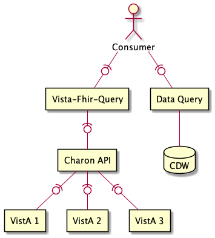
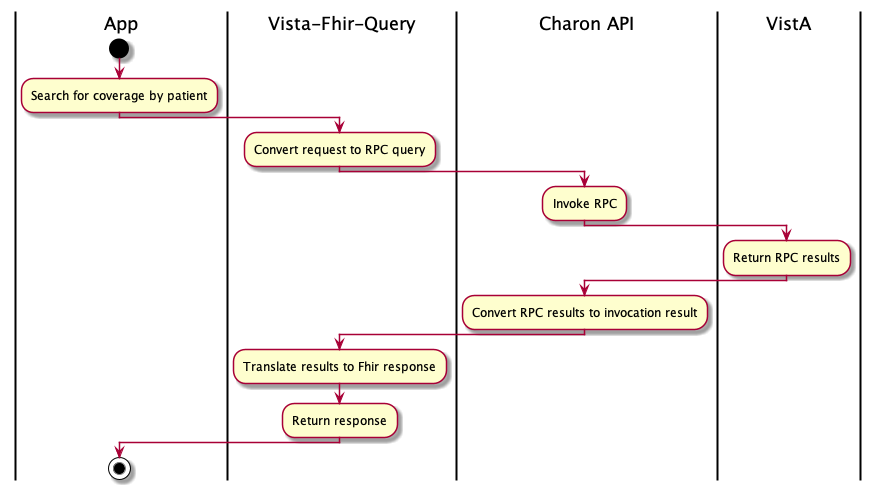

# Charon API

This Charon API provides a simplified mechanism for executing VistA RPC. The REST API allows business applications the ability interact with VistA without the complexity of integrating EJB technology.



### Why?

This approach

- Hides the EJB connection details and knowledge to a single application.
  - Business-level applications just use REST.
  - EJB is communication is difficult to mock for testing or lab use.
  - Easier to ensure EJB and JAAS practices are done correctly since they are done in only one place.
- Business-level services must know RPC details.
- Connection details (host, port, etc.) are encapsulated in one location, but still allows specific details to be optionally specified, e.g., the RPC request can just say `673` to connect to Tampa.

Note:

- Division IEN is needed and determined as station number for the VistA instance. Since the number of Vista instances is fixed and small, this could be "configuration" for the application. Recommendation is to place configuration in a file loaded at boot. The Vista connection file would be managed with deployment unit. Since Vista instances rarely change, this file would rarely need updates. For example:

## Invoking RPCs

Clients will invoke the Charon API by posting a request. Requests contain three pieces of information:

- **The VistA credentials.** The Charon API does not provide credentials, each application must provide their own.
- **The target vistas.** The Charon API allows clients to interact with VistA instances by name, in which case details such as host, port, division IEN, and network connectivity are handled by the API, or directly by specifying Vista coordinates.
- **The RPC details.** Clients must provide the RPC name, context, and any parameters. RPC details support macros for performing common, but complex tasks, such as substituting an ICN with vista site specific DNF value. See [Macros](macros.md)



#### Request structure

```
POST /charon/v1/rpc
```

```
{
  principal: {
    applicationProxyUser: SOME APP PROXY, .. (Optional) Application proxy user
    accessCode: ABC123, .................... Access code
    verifyCode: XYZ987, .................... Verify code
  }
  vista: name/coordinates................... The Vista instance to connect to
  rpc: {
    name: SOME RPC NAME
    context: SOME CONTEXT
    parameters: [   ........................ Optional list of string, reference, or array type parameters
      { string: value },
      { ref: reference },
      { array: [ value, value, ... ] },
      { namedArray: { key: value, key: value, ... }
    ]
  }
}
```

- Vista `coordinates` are specified as `host:port:divisionIen:timezoneId`. For example, `10.11.12.123:18123:456:America/New_York`. See https://en.wikipedia.org/wiki/List_of_tz_database_time_zones
  for time zone IDs.

#### Response structure

```
{
   vista: name ........................ The Vista name, typically a site
   timezone: zoneId ................... The timezone of the Vista instance
   response: <payload>,  .............. Whatever the RPC payload is
}
```

HTTP Status

- `200` if call is successful.
- `400` if an RPC fails.
- `401` if login fails.
- `403` if any RPC is not available to the RPC context.
  > This error is detected by response, e.g., `Code: '182006'; Type: 'VPR GET PATIENT DATA JSON'; Message: 'The remote procedure VPR GET PATIENT DATA JSON is not registered to the option XOBV VISTALINK TESTER.'`
- `408` if an RPC times out.

Error Response Structure

```
{ error: message }
```

### Configuration

Configuration is managed per environment and deployed with the Charon API. You may inspect the configuration using by invoking `GET ${charon-url}/v1/rpc/connections`

```
{
  vistas: [
    { name: lomalinda, host: loma-linda.med.va.gov, port: 18105, divisionIen: 605 },
    ...
  ]
}
```

## Authorization Status Support

Charon supports a special API for some authorization use cases. See [Authorization Status](authorization-status.md) for details.

## Local Development

- Execute `src/scripts/make-configs.sh` (requires `secrets.conf` from a team member)
- See [lighthouse-vista-docker](https://github.com/department-of-veterans-affairs/lighthouse-vista-docker) for a local VistA instance

## Manually Testing RPCs.

The Charon API provides a test image that can be used for ad-hoc testing of RPCs. There are two Docker-based techniques

#### `charon-tests/test-request-file`

- Recommended technique
- Specify Charon RPC request as a file
- Supports all Charon authentication mechanism

# Additional Considerations

Charon uses VistaLink XOB libraries that are not available in an easy to use Maven repository. The `xob-1.6.0.028` module in this repository provides a utility that can be used install the required libraries locally.
